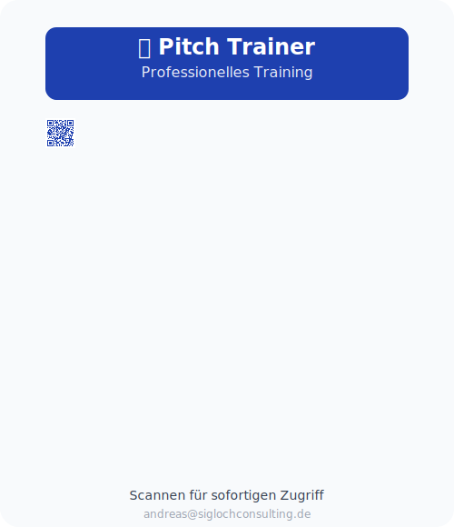

# 🎤 Pitch Trainer

Professional pitch training application for practicing and analyzing sales pitches.

## 📱 Quick Access

**Scan to access instantly!**

🔗 **Live App**: https://olive-dode-61.tiiny.site

## Features

- **Timer Selection**: Choose from 30-120 seconds for your pitch
- **Live Recording**: Uses Web Speech API for real-time transcription
- **Smart Analysis**: Analyzes timing, filler words, sentiment, and more
- **Professional Export**: Copy detailed analysis to clipboard
- **Mobile Responsive**: Works perfectly on all devices

## Quick Start

1. **GitHub**: https://github.com/andreassigloch/PitchTrainer
2. **Live Demo**: [Will be deployed to Vercel]

## Usage

1. Select your desired pitch duration (30-120 seconds)
2. Click "Training starten" to begin recording
3. Speak your pitch - transcript appears in real-time
4. Click "Beenden" or let timer run out
5. Review your analysis and recommendations
6. Use "Kopie" to export results

## Technical Details

- Single HTML file with embedded CSS and JavaScript
- Uses Web Speech API (requires HTTPS in production)
- Mobile-first responsive design
- No build process required
- Compatible with all modern browsers

## Deployment

### Vercel Deployment

1. Install Vercel CLI: `npm install -g vercel`
2. Login: `vercel login`
3. Deploy: `vercel --prod`

The app is configured for automatic deployment via `vercel.json`.

## Analysis Features

- **Timing Analysis**: Optimal duration detection
- **Filler Word Detection**: Identifies "äh", "also", etc.
- **Speaking Pace**: Words per second analysis
- **Sentiment Analysis**: Positive language detection
- **Call-to-Action**: CTA phrase identification
- **Specificity Check**: Numbers and facts detection

## Author

Created by andreas@siglochconsulting

## License

MIT License